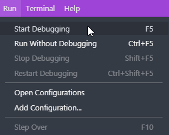

# hackattoni

A repo containing some tools to automate a github process
It can be used from any local repository

## What this tool does
- creates a PR on master branch of a specific remote
- copy from specified issue number to PR the labels and milestone
- it uses a template for the pr body

## Requirements
NodeJS >= 12 (download [here](https://nodejs.org/it/))

## Setup of this repo
clone the repo locally (only once)

`git clone https://github.com/mbarto/hackattoni.git`

update dependencies

`npm install`

## Usage
In order to use it locally:
- [required] create in the root the *configOptions.json* file with the following properties
- [optional] create in the templatePath the md file to be used in the pr otherwise a default template will be used

| param |default | note | required |
|--|--|--|--|
| fork | myrepo | the name of the remote that points to your forked repo | yes |
| remote | origin | the name of the remote that points to the cloned and original repo | yes |
| githubToken |  | checkout [this guide](https://help.github.com/en/github/authenticating-to-github/creating-a-personal-access-token) on how to create a token | yes |
| templatePath | "./.github/PULL_REQUEST_TEMPLATE.md" | a custom path for the body that will be used in the PR| no |

**Example**
```json
{
	"fork": "myrepo",
	"remote": "origin",
	"githubToken": "YourToken",
	"templatePath": "./.github/PULL_REQUEST_TEMPLATE.md"
}
```

**Procedure**
- go to any repo and open a shell with git bash (or any other)
- run this command `node path_to_hackattoni_folder/create_pr.js ISSUE_NUMBER`


## How to Debug (with VS Code)

This repo is already configured for the debug:

in order to debug go to the run Tab and click "Start Debugging"



or click **Run** icon on the left


## How to Debug from another Repo (with VS Code)

- just copy the .vscode/launch.json in your .vscode folder
- edit it with the correct path to the createPr.js